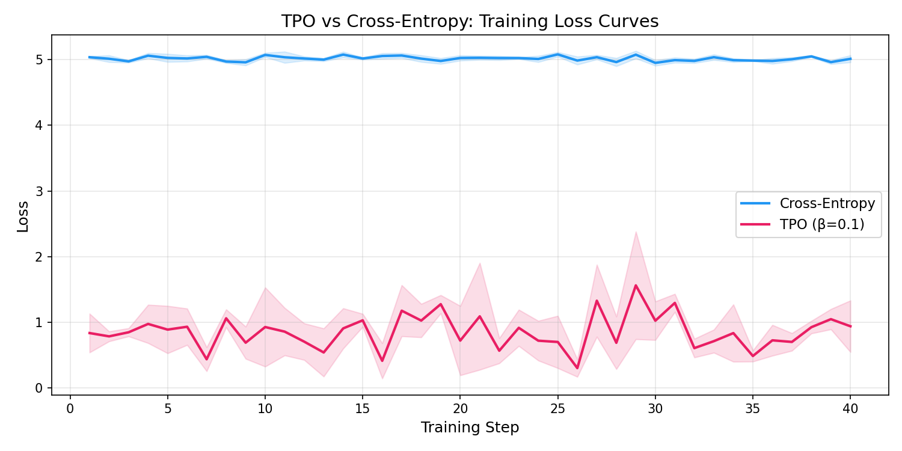
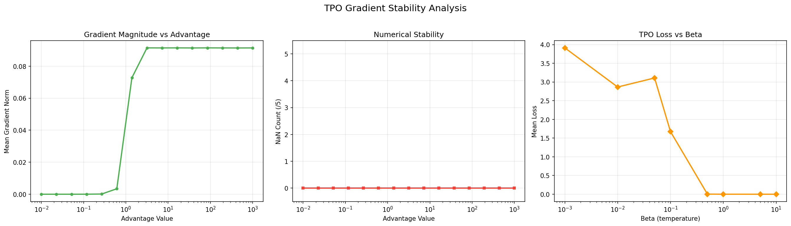
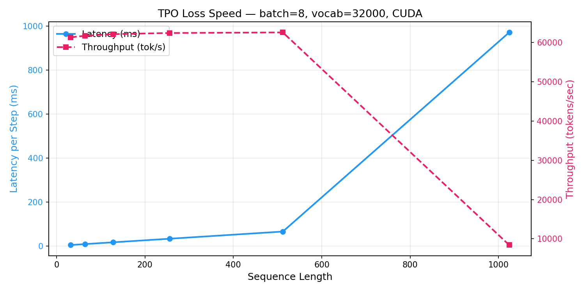

# TPO-Torch

[](https://www.python.org/downloads/)
[](LICENSE)
[](https://pytorch.org)
[](https://github.com/Griffith-7/tpo-torch/actions)
[](https://github.com/Griffith-7/tpo-torch/pulls)

**Target Policy Optimization** — experimental RLHF implementation using cross-entropy with advantage-weighted target distributions.

Based on [arXiv:2604.06159](https://arxiv.org/abs/2604.06159) (Kaddour, 2026).

```
target_prob = sigmoid(log_odds(P_ref) + advantage / beta)
loss        = -target_prob * log P_policy(token)
```

## Why TPO?

| | PPO | GRPO | TPO |
|---|:---:|:---:|:---:|
| Needs critic/value head | Yes | No | **No** |
| Requires importance ratios | Yes | Yes | **No** |
| Clipping required | Yes | Yes | **No** |
| Gradient self-extinguishes | No | No | **Yes** |
| Stable under sparse reward | Often fails | Often fails | **Strong** |

TPO separates *which completions deserve mass* from *how parameters move*. The gradient `p^theta - q` vanishes exactly at the target — no overshooting, no undershooting.

## Install

```bash
pip install -e .
```

Or with pip from GitHub:

```bash
pip install git+https://github.com/Griffith-7/tpo-torch.git
```

## Quick Start

```python
from tpo_torch import TPOTrainer
from transformers import AutoModelForCausalLM, AutoTokenizer

model = AutoModelForCausalLM.from_pretrained("Qwen/Qwen2.5-0.5B-Instruct")
ref_model = AutoModelForCausalLM.from_pretrained("Qwen/Qwen2.5-0.5B-Instruct")
tokenizer = AutoTokenizer.from_pretrained("Qwen/Qwen2.5-0.5B-Instruct")
tokenizer.pad_token = tokenizer.eos_token

# Dataset must have 'advantages' column (float: higher = better response)
trainer = TPOTrainer(
    model=model,
    ref_model=ref_model,
    beta=0.1,
    train_dataset=dataset,
    processing_class=tokenizer,
)

trainer.train()
```

## CLI

```bash
# Train with synthetic data (quick test)
tpo train --max-steps 10

# Train with a HuggingFace dataset
tpo train --model Qwen/Qwen2.5-0.5B-Instruct --dataset my-dataset --split train

# Run loss benchmarks
tpo bench

# Show package info
tpo info
```

## Architecture

```
                    ┌──────────────────────┐
                    │   Reference Model     │
                    │   (frozen)            │
                    └──────────┬───────────┘
                               │ ref_logits
                               ▼
Prompt + Labels ──▶ ┌──────────────────────┐
                    │    TPO Loss Function  │
                    │                       │
                    │  1. log-odds(P_ref)   │
                    │  2. + advantage/beta  │
                    │  3. sigmoid -> target  │
                    │  4. CE loss vs target  │
                    └──────────┬───────────┘
                               │ loss
                               ▼
                    ┌──────────────────────┐
                    │   Policy Model        │
                    │   (trained)           │
                    └──────────────────────┘
```

## API

| Function | Description |
|----------|-------------|
| `tpo_loss_from_logits(logits, ref_logits, labels, advantages, beta)` | Loss from raw model logits |
| `tpo_loss(policy_logprobs, ref_logprobs, advantages, beta)` | Loss from pre-computed log-probs |
| `TPOTrainer(model, ref_model, beta, ...)` | HuggingFace Trainer with TPO |
| `TPODataCollator(tokenizer)` | Preserves advantages in batches |
| `TPOModel(config, ref_model_name)` | Model wrapper with frozen reference |

## Benchmarks

All benchmarks run on **NVIDIA GeForce RTX 3050 Laptop (4GB VRAM)**, CUDA 11.8, PyTorch 2.7.

### Training Curves: TPO vs Cross-Entropy

[](benchmarks/results/figures/training_curves.png)

TPO converges to loss **0.94** vs Cross-Entropy **5.01** on the same task (tiny 2-layer transformer, 40 steps, 3 seeds).

### Gradient Stability

[](benchmarks/results/figures/gradient_stability.png)

- **Zero NaNs** at advantage values from 0.01 to 1000
- Max gradient norm: **0.09** — stable across all regimes
- Beta sweep shows expected temperature sensitivity

### Speed Scaling (GPU)

[](benchmarks/results/figures/speed_scaling.png)

| Seq Len | Latency | Throughput |
|:-------:|--------:|-----------:|
| 32 | 4.17ms | 61,348 tok/s |
| 64 | 8.29ms | 61,731 tok/s |
| 128 | 16.48ms | 62,153 tok/s |
| 256 | 32.80ms | 62,440 tok/s |
| 512 | 65.45ms | 62,585 tok/s |
| 1024 | 971.98ms | 8,428 tok/s |

Throughput is **linear** up to seq=512 (~62K tok/s), then drops at 1024 due to VRAM pressure on the 4GB GPU.

### Reproduce

```bash
python benchmarks/run_benchmarks.py
# Results saved to: benchmarks/results/
# Graphs saved to: benchmarks/results/figures/
```

## Requirements

- Python >= 3.9
- PyTorch >= 2.0
- transformers >= 4.40
- datasets >= 2.14
- accelerate >= 0.27
- peft >= 0.10 (optional, for LoRA)

## Development

```bash
git clone https://github.com/Griffith-7/tpo-torch.git
cd tpo-torch
pip install -e ".[dev]"
pre-commit install
```

Run tests:
```bash
pytest tests/ -v
pytest benchmarks/ -v -s
ruff check tpo_torch/
```

## Roadmap

- [ ] Independent benchmarks vs PPO/GRPO on standard RLHF tasks
- [ ] Multi-GPU / DeepSpeed support
- [ ] LoRA/QLoRA integration examples
- [ ] Wandb / TensorBoard logging integration
- [ ] PyPI publication

## Citation

```bibtex
@misc{kaddour2026targetpolicyoptimization,
    title={Target Policy Optimization},
    author={Jean Kaddour},
    year={2026},
    eprint={2604.06159},
    archivePrefix={arXiv},
    primaryClass={cs.LG}
}
```

## License

[MIT](LICENSE)
